[comment]: # "This is the standard layout for the project, but you can clean this and use your own template"

# Human Emotion Detection with Electrocardiographic-Electroencephelographic and Other Signals

#### Team

- E/17/144, KPCDB Jayaweera, [e17144@eng.pdn.ac.lk](mailto:e17144@eng.pdn.ac.lk)
- E/17/091, PGAP Gallage, [e17091@eng.pdn.ac.lk](mailto:e17091@eng.pdn.ac.lk)
- E/17/405, WDLP Wijesinghe, [e17405@eng.pdn.ac.lk](mailto:e17405@eng.pdn.ac.lk)

#### Supervisors

- Prof.Roshan Ragel, [roshanr@eng.pdn.ac.lk](mailto:roshanr@eng.pdn.ac.lk)
- Dr.Isuru Nawinne, [isurunawinne@eng.pdn.ac.lk](mailto:isurunawinne@eng.pdn.ac.lk)
- Dr.Mahanama Wickramasinghe, [mahanamaw@eng.pdn.ac.lk](mailto:mahanamaw@eng.pdn.ac.lk)
- Dr.Vajira Thambawita, [vajira@simula.no](mailto:vajira@simula.no)

#### Table of content

1. [Abstract](#abstract)
2. [Related works](#related-works)
3. [Methodology](#methodology)
4. [Experiment Setup and Implementation](#experiment-setup-and-implementation)
5. [Results and Analysis](#results-and-analysis)
6. [Conclusion](#conclusion)
7. [Publications](#publications)
8. [Links](#links)

## Abstract

In this research, we explore the integration of Electroencephalography (EEG) and Electrocardiography (ECG) data to classify human emotions through Convolutional Neural Networks (CNN) to enhance emotion classification accuracy.

Our study involves our own data collection process from participants via video and audio stimuli to elicit five distinct emotions. However, due to the limited sample size, our approach is trained on the DREAMER dataset, which provides signals recorded during affect elicitation via audio-visual stimuli from 23 participants, along with their self-assessment in terms of valence, arousal, and dominance.

Understanding and classifying human emotions is a complex and an important aspect of human-computer interaction and healthcare. EEG captures neural activity and reflects neural patterns associated with cognitive processing, while ECG records cardiac signals and provides insights into autonomic nervous system responses. The combination of these two enhances the robustness and depth of emotion classification and helps to accurately identify emotions of a person at a given instance.

<!-- ## Related works -->

## Methodology

The project consists of two stages: the data acquisition stage and the development of the CNN model.

#### Stage 1: Data Aquisition

EEG and ECG data were collected during the initial stage of the project. There were several steps to follow for each participant to ensure proper data collection.

1. Read the information sheet
   - [sheet](https://docs.google.com/document/d/1kH4Qc642DGC6JXFG4AZ8_8hR5N0Sukr8RF1XjaJ_s2U/edit)
   - Each participant should read the information sheet and get prior knowledge of the study before participating and they must agree to the terms and conditions.
2. Do the pre experiment survey

   - [form](https://docs.google.com/forms/d/e/1FAIpQLSewSYhT5gAMh9bNCn5KEJD6RPty2wUojrs8no-RuE5fgjSv6w/viewform)
   - This is to get the required information about the participant before participating in the study. Note that, all the data that were collected are anonymous and confidential.
   - We are collecting general information (age, gender,..), medical history, background details (nationality, race, religion,..), psychological measures, and technical information which we consider as important to study about the variety of the dataset.

3. Show audio,video stimuli
   - After completing the pre-experiment survey, we placed the equipment (EEG and ECG electrodes) on the participant and then the videos were shown to the participant.
   - There were five videos considering five emotions.
4. Do the post experiment survey
   - [form](https://docs.google.com/forms/d/e/1FAIpQLScAYqNibYVf16e_Ot6wFv2-LuvqbFBnrWLDJkyoghvEkMZi2g/viewform)
   - After each video, the relevant section of the post-examination survey was provided to the participants to fill by themself.
   - The reason for this survey was to know to what extent the emotion that we were expecting from the video was stimulated in the participants.

#### Stage 2: Development of the CNN Model

    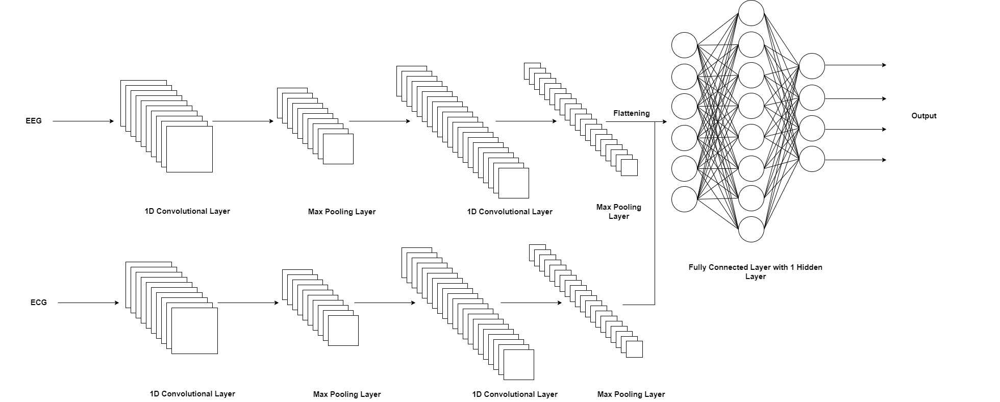 
    <i>Fig.01: ECG Setup</i>

## Experiment Setup and Implementation

#### Hardware Setup and Data Collection

The hardware setup (EEG device and ECG device) should be correctly placed on the participant before collecting data. It involved several steps;

- There were 8 electrodes in the EEG device. As we used a customized, wearable EEG setup (Fig 03), it was thoroughly checked for correct placement of each electrode on the scalp.
- The ECG device had 3 electrodes and needed to have enough electrode gel before placing them. The electrode placements are shown in Fig 02, 04 and 05.

    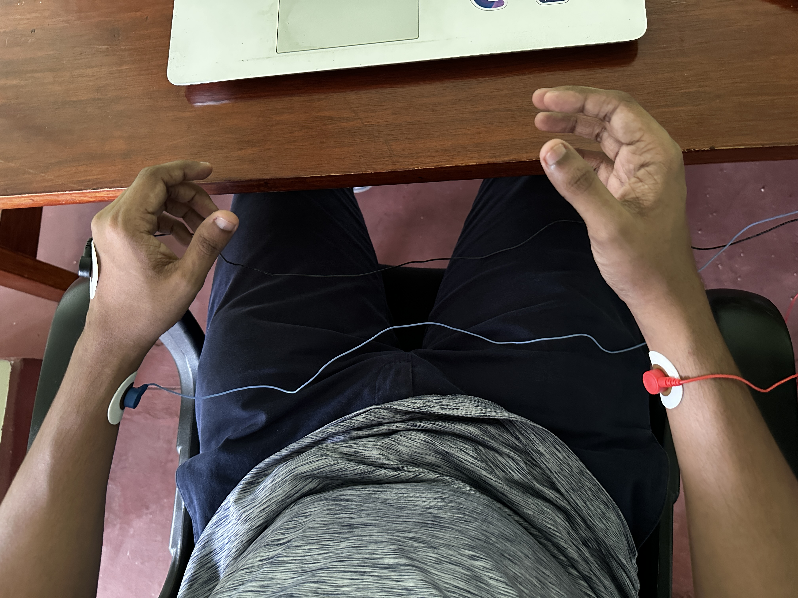 
    <i>Fig.02: ECG Setup</i>

    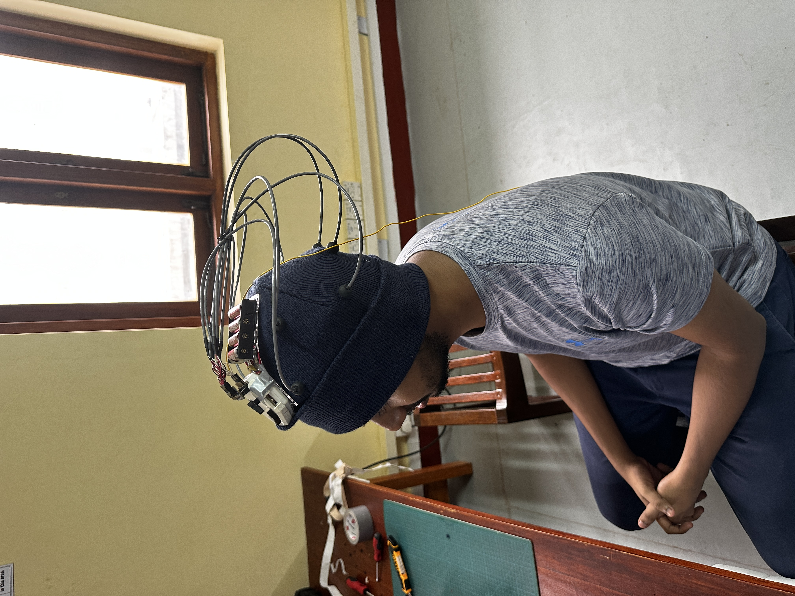 
    <i>Fig.03: EEG Setup</i>

    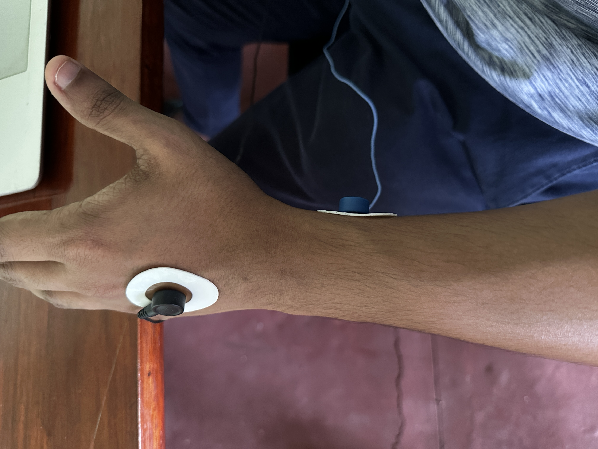 
    <i>Fig.04: Electrode Placement Left</i>

    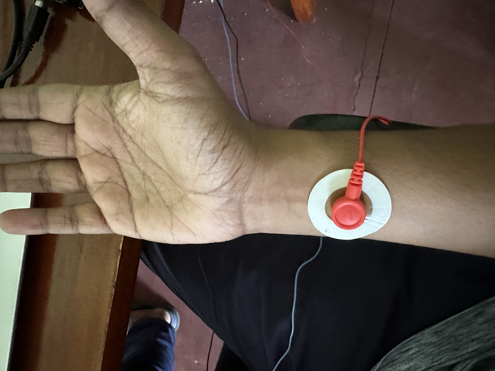 
    <i>Fig.05: Electrode Placement Right</i>

    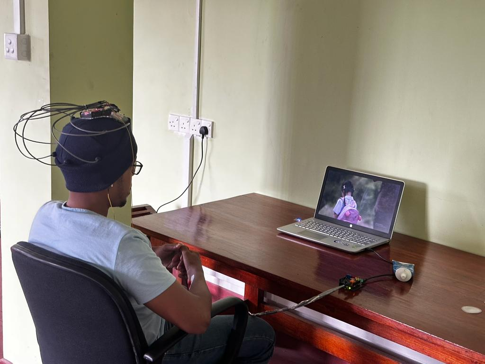 
    <i>Fig.06: Data Collection Process</i>

#### Software System

The data collection UI was used as the frontend to collect data. There are 5 emotions, therefore 5 videos. After starting the data collection, the video pops into full screen. An image of the UI is shown below.

     
    <i>Data Collection UI</i>

The backend was developed using python flask. As there were 2 process to run parallelly, we added 2 seperate multiprocessors; one for EEG data collection from EEG device and another one for ECG data collection from ECG device.

    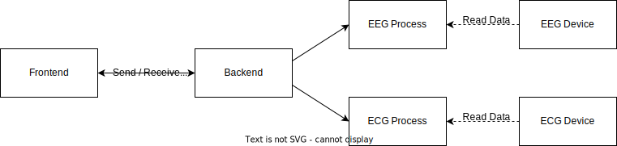 
    <i>Backend</i>

#### Data and Processing

After collecting data, we have used filters to remove noises that were added from nearby electronic devices.

- Butterworth bandpass filter within the 0.05 Hz to 100 Hz frequency range.
- Frequency of data collection ECG - 1000Hz , EEG - 250Hz

The raw signals and filtered signals are shown in below figures.

    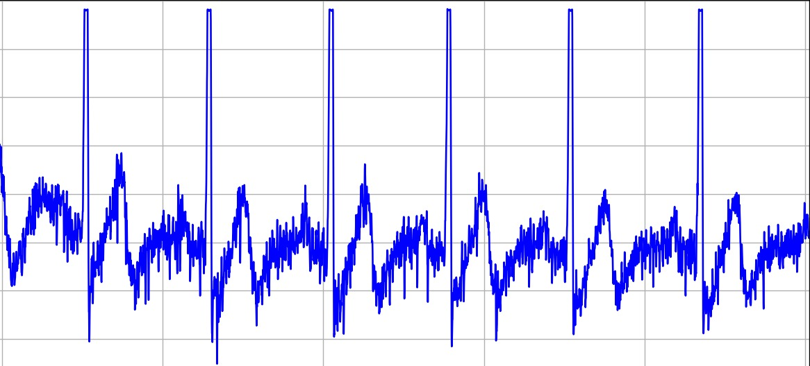 
    <i>Raw Signal</i>

    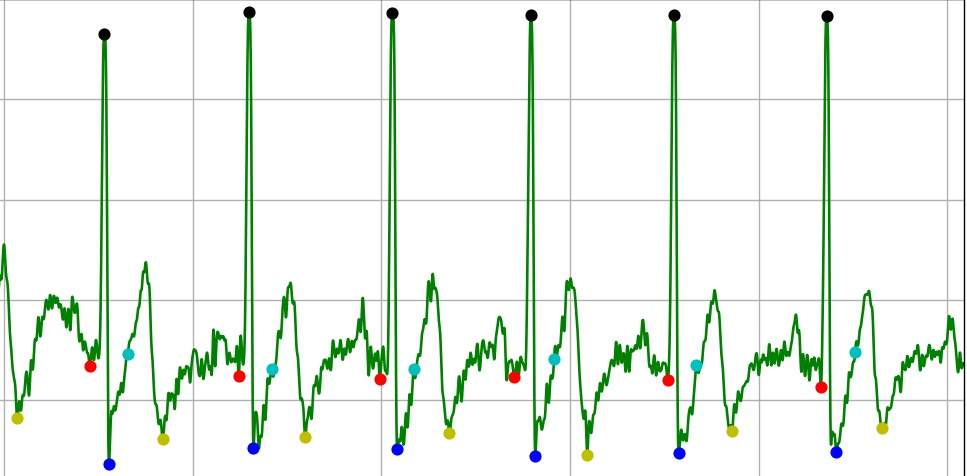 
    <i>Filtered Signal</i>

    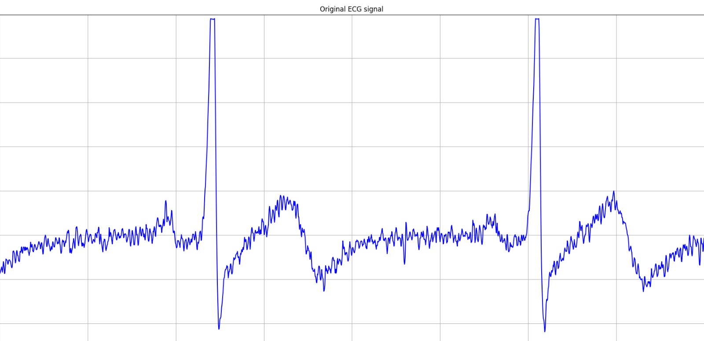 
    <i>Raw Signal - Zoomed</i>

    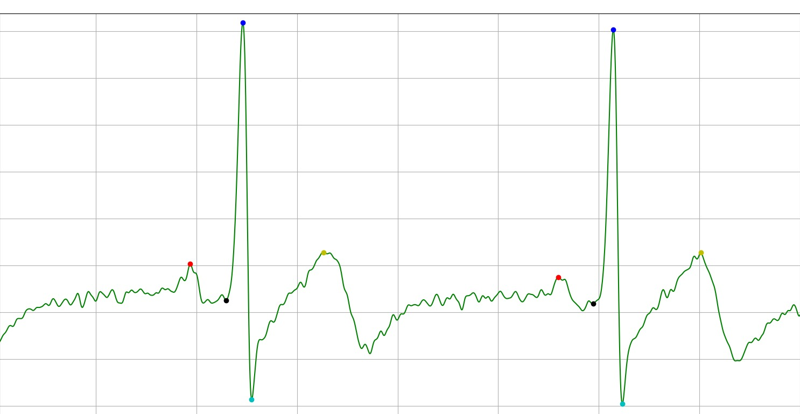 
    <i>Filtered Signal - Zoomed</i>

## Results and Analysis

<!-- ## Conclusion

## Publications -->

## Links

- [Project Repository](https://github.com/cepdnaclk/e17-4yp-Human-Emotion-Detection-with-Electrocardiographic--Electroencephelographic-and-Other-Signals)
- [Project Page](https://cepdnaclk.github.io/e17-4yp-Human-Emotion-Detection-with-Electrocardiographic--Electroencephelographic-and-Other-Signals)
- [Department of Computer Engineering](http://www.ce.pdn.ac.lk/)
- [University of Peradeniya](https://eng.pdn.ac.lk/)
